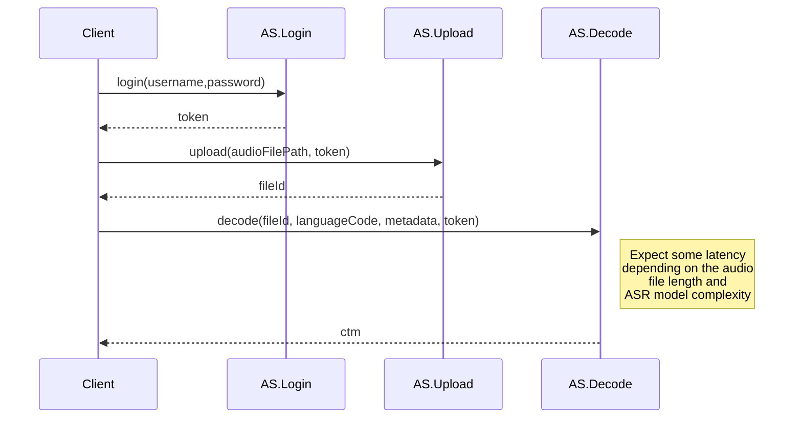

audioserver
=======================================================

**audioserver** (AS) is a state-of-the-art backend webservice for transcribing (decoding) audio files (multilingual) with automatic speech recognition (ASR) technology in real-time via standard https requests.

***Version***: 1.0

***Since***: July 2022

*by Cristian Tejedor-García*.

*Centre for Language and Speech Technology (CLST), Radboud University Nijmegen*.

###  How it works
The main idea is that AS provides a word hypothesis response in time-marked conversation (ctm) format after decoding an audio file (located in your computer or in the cloud) in real-time.

#### Option A:
***Upload&Decode*** an audio file from your local computer:

#### Option B:
***Download&Decode*** an audio file from the cloud:

### Features

1. *Easy deployment and development*: Docker + UNIX/Linux + Node.JS Express + MongoDB + [Kaldi](https://hub.docker.com/r/kaldiasr/kaldi).

1. *RESTful API*: Client apps can send/receive information easily through a JSON REST API.

1. *Flexible ASR infrastructure:* Possibility of choosing the language/acoustic models and the beam parameter on-the-fly for decoding.

1. *Multilingual ASR*: There is no limitation on the number of ASR decoding languages since we can choose which one to use on-the-fly.

1. *Very low latency*: The response time will depend on internet connection speed (client and server), length of the audio file and ASR model complexity.

1. *'Unlimited' parallel connections/requests*: The server can process in parallel as many connections as possible (depending on the number of CPUs of your machine).

1. *Tracking of users's audiofiles*: MongoDB database + folder (per user) with audio files with unique IDs.

1. *Full compatibility with any client-app/device*: The communication protocol can be adjusted easily.

1. *API documentation*: [Swagger](https://restasr.cls.ru.nl/api-docs) (standard http protocol).

1. *Easy communication between independent Docker containers*: Unix pipelines.

1. *Web logs*: The web server keeps a trace of all users' interaction with the system.

1. *Security*:
   1. jsonwebtoken ([JWT](https://jwt.io/)) for login authentication and secure requests.
   1. https for encrypted and secure data transmission client-server.
   1. The audio files can be removed after obtaining the transcription (the user can select this option on-the-fly).
   1. Strong login passwords (bcrypt).
   1. Login: Maximum number of wrong attempts –> 1 day ban (we can change this value, of course).
   - Ticket system: Max. number of requests: regular vs. admin users. Currently: 50 requests/hour (default users). Admin users have no limitations. This value can be set for every user individually.
   1. Register: Email confirmation token.
   1. requests: Required and validation parameters rules for correct requests.
   1. Type of the audio file: .wav, .ogg, etc. (fully customizable).
   1. Size limit of the audio file: 5 MB (fully customizable).

###  Installation

1. Download the source code of this repository into a folder (*audioserver*).

`cd audioserver`

2. Install Docker and some utilities on your Linux machine following this file:

`vim READMEs/README-docker_first_install.md`

3. Set the corresponding values to these two files:

`vim .mongo-variables.env`

`vim .web-variables.env`

4. Start the docker-compose.yml

`./_startdocker.sh`

###  Source code
The source code will be available soon.

### API documentation
`Swagger` : <https://restasr.cls.ru.nl/api-docs>

### How to cite this work
If you use this software for research/work, you can cite this repository giving credit to, at least, Cristian and CLST.

### Contact
[Cristian Tejedor-García](https://cristiantg.com) : **cristian [dot] tejedorgarcia [at] ru [dot] nl**

[Centre for Language and Speech Technology (CLST), Radboud University](https://www.ru.nl/clst/vm/contact-us/ "CLST")
